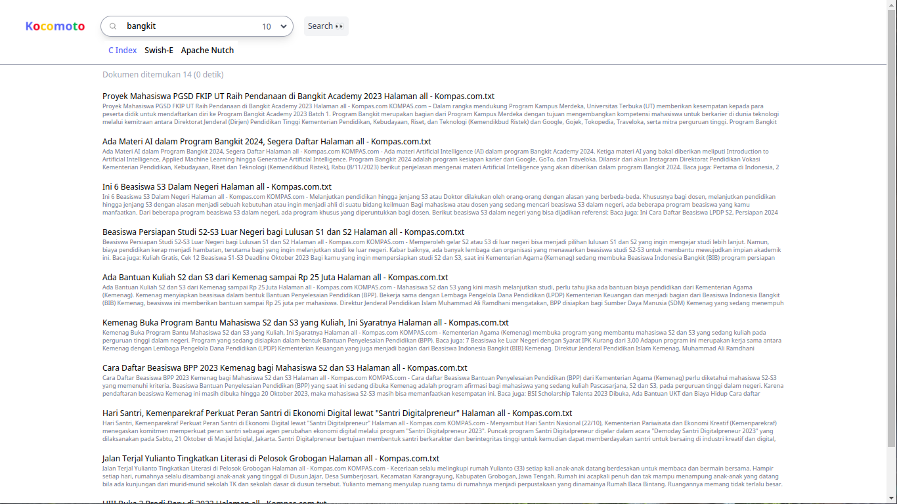

# ProjectAkhir-PI-SearchEngine
Make a Search Engine :)




# Instalasi
Sebelum melakukan instalasi, diperlukan beberapa program berikut
- swish-e 2.4.7
- apache solr
- npm
- Docker (Optional)

## Build dari source tanpa docker
Yang pertama adalah pastikan telah terinstall swish-e pada perangkat
```bash
# Cek version swish-e
$ swish-e -V
SWISH-E 2.4.7
```
### TailwindCSS
Lakukan instalasi TailwindCSS
```bash
npm install
```

Compile TailwindCSS
```bash
npx tailwindcss -i ./static/src/input.css -o ./static/dist/css/output.css
```

### Flask
Install library python yang ada didalam **requirements.txt**
```bash
pip install -r requirements.txt
```

### Compile Index-C dan Jalankan Apache Nutch + Solr
Compile Index-C
```bash
bash setup.sh -i C
```
Jalankan Apache Nutch + Solr
```bash
bash setup.sh -i nutch
```

### Jalankan Flask
Menggunakan flask
```bash
flask --app app run
```
atau menggunakan python
```bash
python3 -m flask --app app runn
```
Web dapat dilihat pada [http://localhost:5000](http://localhost:5000) atau [http://127.0.0.1:5000](http://127.0.0.1:5000)

## Build dengan menggunakan Docker
Build aplikasi menjadi docker images
```bash
docker build -t search-engine .
```
Jalankan container dengan image yang telah dibuild
```bash
docker run -p 5000:5000 -p 8983:8983 --name search-engine search-engine
``` 
Restart service apache nutch dan jalankan semua index
```bash
# Masuk ke dalam container
docker exec -it search-engine bash 

# Pada bash container jalankan kedua perintah berikut
$ bash setup.sh -r nutch
$ bash setup.sh -in all
```
Web dapat dilihat pada [http://localhost:5000](http://localhost:5000) atau [http://127.0.0.1:5000](http://127.0.0.1:5000)