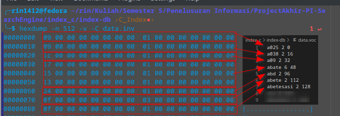
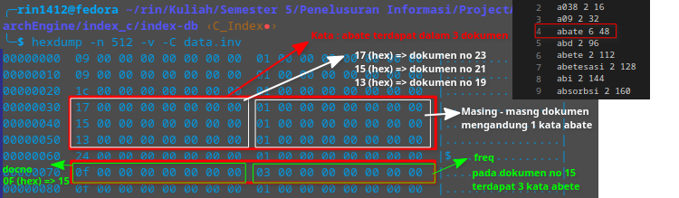
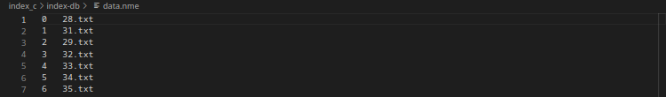
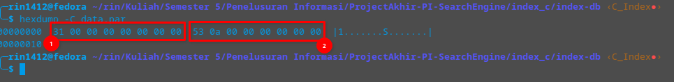
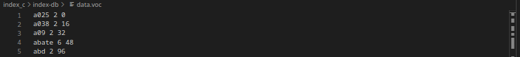
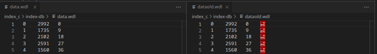

# Hasil Analisis Index C

## File data.inv
<br>
Pada file ```data.inv``` berisikan nomor dokumen dan frekuensi dari sebuah kata dengan urutan sesuai dengan kata pada
file ```data.voc```<br>

<br>
Struktur dari ```data.inv``` untuk setiap data kata pada sebuah dokumen terdapat 2 nilai yaitu *docno* yaitu nomor dokumen
dan *freq* yaitu jumlah kemunculan kata dalam dokumen tersebut. Kedua nilai ini disimpan dalam bentuk *long int (32 bit)* sehingga untuk setiap kemunculan kata dalam sebuah dokumen diperlukan *64 bit*


## File data.nme
<br>
Pada file ```data.nme``` berisi daftar dari nomor dokumen dan nama file dari dokumen tersebut.

## File data.par
<br>
Pada file ```data.par``` berisikan 2 buah parameter
- Banyak dokumen (Nomor 1) Dengan tipe *long int (32bit)*
- Banyak kata unik (Nomor 2) dengan tipe *long int (32bit)*

## File data.voc
<br>
Pada file ```data.voc``` berisikan semua kata yang unik, jumlah kata dan offset (letak kata pada index ```data.inv``` dalam bytes)

## File data.wdl
<br>
Pada file wdl berisikan datkanana nomor dokumen, panjang dokumen dan nilai offset nomor dan nama dokumen yang terdapat pada file ```data.nme```. Pada gambar kanan adalah file yang sebelum diperbaiki terdapat bagian yang error dikarenakan melakukan write sebuah variabel kosong. Gambar kiri adalah keadaan file ketika telah dilakukan perbaikan pada commit (*id_commit*)

# Log
- index-db.c<br> 
**Tidak dapat membuka file (kesalahan path)** -> FIX at [COMMIT #7bfaa37](https://github.com/toosakarin1412/ProjectAkhir-PI-SearchEngine/commit/7bfaa37bfae1b5f793040712eb1b059cae1f4ce6)<br>
Penambahkan ```strcat(path,"/")``` untuk memperbaiki path.
<br><br>
**Kesalahan ketika melakukan write kedalam file data.wdl** -> FIX at [COMMIT #b46b05d](https://github.com/toosakarin1412/ProjectAkhir-PI-SearchEngine/commit/b46b05dcb88bf87dca5ce2d75c8b6ae192383c0c)<br>
Menghilangkan variabel ```char class[WORDLEN]```, variabel ini tidak pernah diisi dan dilakukan write kedalam file data.wdl<br>
Merubah ```fprintf(finf, "%ld\t %ld \t%ld\t %s\n", docno, doclen, offset, class)``` menghilangkan write variabel class menjadi ```fprintf(finf, "%ld\t %ld \t%ld\n", docno, doclen, offset)``` sehingga file data.wdl hanya menyimpan  docno, doclen, offset.

- define.h<br>
**Nilai Buffer 256 terlalu kecil** -> FIX at [COMMIT #408cc3e](https://github.com/toosakarin1412/ProjectAkhir-PI-SearchEngine/commit/408cc3e86e1d722dd15696b477c6bcf85b970c41)<br>Terjadi warning ketika membaca file ```data.nme``` nilai yang dibaca adalah 512bytes sedangkan ukuran buffer hanya 256bytes <br>
Nilai Buffer dinaikkan menjadi 512bytes

- query-with-doclen.c<br>
**Bytes yang dibaca pada ```data.inv``` tidak sesuai dengan ukuran variabel penampung ```ilbuf```** -> FIX at [COMMIT #44555e5](https://github.com/toosakarin1412/ProjectAkhir-PI-SearchEngine/commit/44555e549a250728723991d749e1d0290dc8a0e5)<br>
Pada kode yang melakukan read pada file index ```fread(ilbuf,sizeof(int),len,finv);``` diubah menjadi ```fread(ilbuf,sizeof(long int),len,finv);```<br>
Karena ukuran ```ilbuf``` adalah *```long int```*
<br><br>
**Kesalahan ketika melakukan normalisasi accumulator** -> FIX at [COMMIT #d9db858](https://github.com/toosakarin1412/ProjectAkhir-PI-SearchEngine/commit/d9db858ec75a21943a6aa45222e39c3c496c01a6)<br>
Pada kode untuk melakukan normalisasi nilai accumulator, nilai accumulatoor akan dibagi dengan panjang dokumen. Namun pada kode index panjang dokumen salah dan bernilai statis tidak. Sehingga prehitungan normalisasi menjadi salah dan pada kasus tertentu menyebabkan *core dump error*.<br>
Pada bagian ```accumulator[i] += accumulator[i] / fileinfo[docno].doclen;``` di ubah menjadi ```accumulator[i] += accumulator[i] / fileinfo[i].doclen;``` Karena docno bukanlah variabel yang relevan dengan panjang setiap dokumen.
